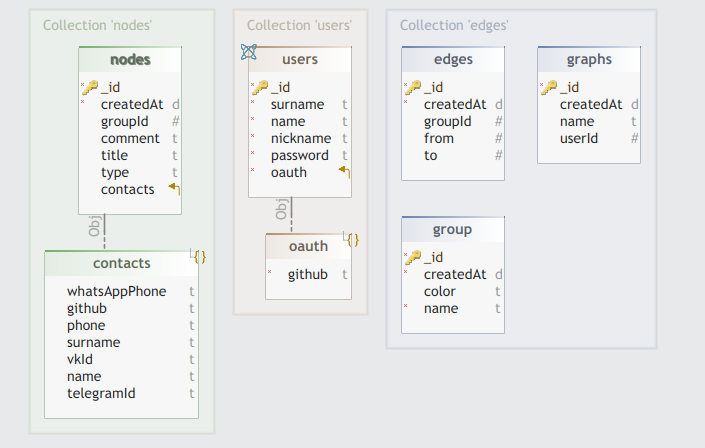

# Sigma Contacts

## Application Architecture

### Backend

The decision was made to use the Go + Gin Framework

### Frontend

The decision was made to use the React Framework + [Sigma.js](https://github.com/jacomyal/sigma.js)

#### CSS Framework

The decision was made ti use the [Chakra-UI](https://www.chakra-ui.com/)

### Data Store 

The decision was made to use the NoSql MongoDB 

#### MongoDB Client

I suggest using the [MongoDB compass](https://www.mongodb.com/products/tools/compass) client 

#### Application for ER-diagrams

I suggest using the [DbSchema](https://dbschema.com/)

#### ERD

1. First iteration

